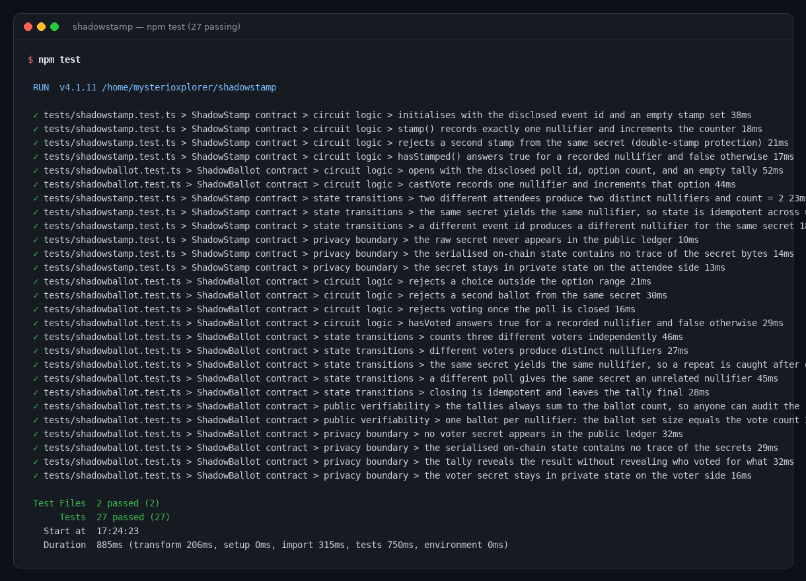
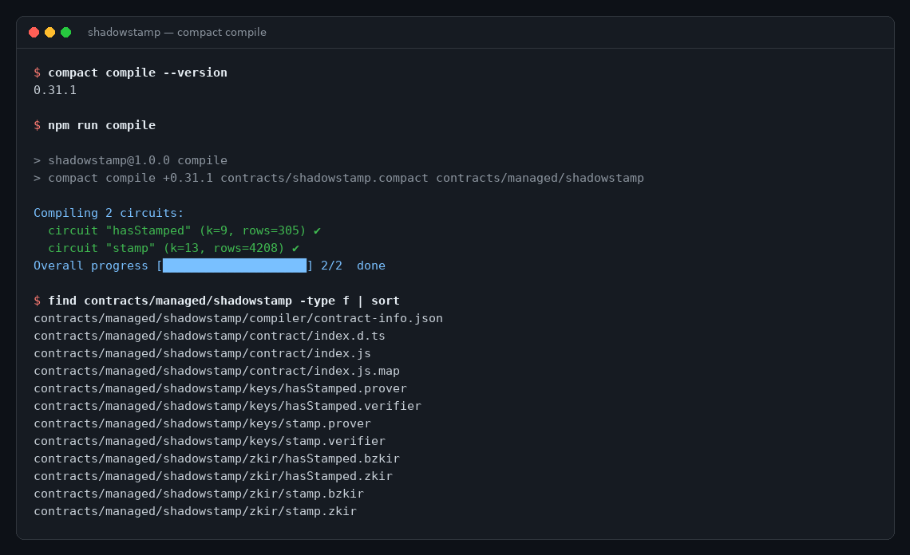
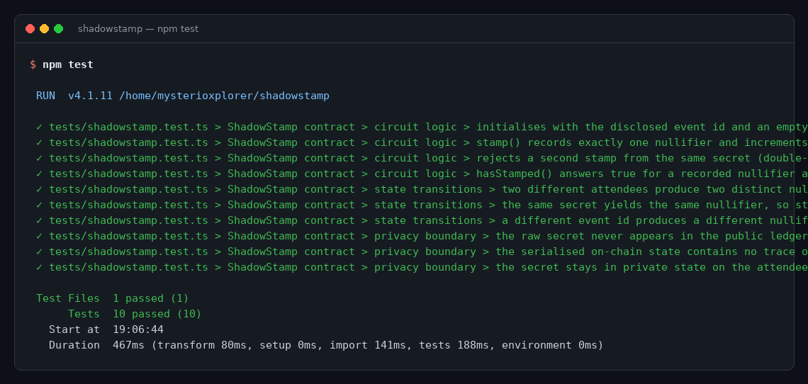
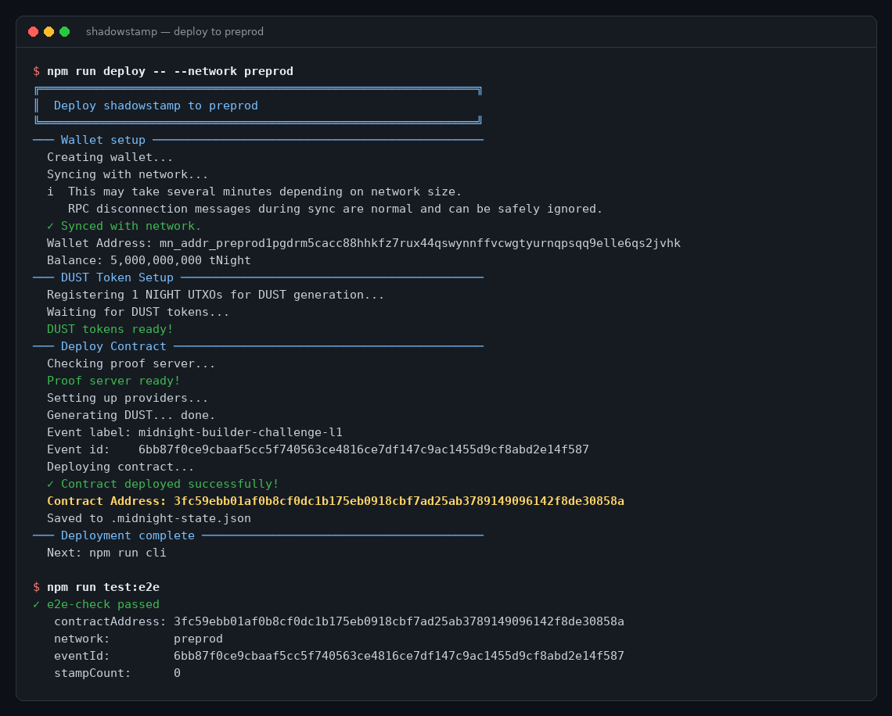
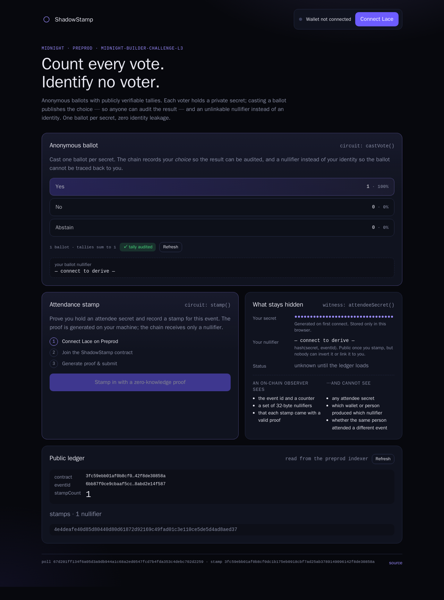

# ShadowStamp

> A privacy-preserving proof-of-presence contract on Midnight: attendees prove they were at an event exactly once, without revealing who they are.

[](https://github.com/nisargpatel7042lva/shadowstamp/actions/workflows/ci.yml)
[](https://github.com/nisargpatel7042lva/shadowstamp/actions/workflows/deploy-pages.yml)

**Midnight Builder Challenge — 🌑 Level 1 · 🌒 Level 2 · 🌓 Level 3**
L1: toolchain, Compact contract, tests, deployed to Preprod.
L2: React frontend wired to the contract with Lace wallet connect on Preprod.
L3: **ShadowBallot** — anonymous ballots with publicly verifiable tallies, 27 tests, CI on every push.

---

## Live Demo

**https://nisargpatel7042lva.github.io/shadowstamp/**

Open it with the [Midnight Lace](https://chromewebstore.google.com/search/midnight%20lace) extension
installed and set to **Preprod**. The public ledger (event id, stamp count, nullifier set) loads
without a wallet; connecting Lace is only needed to stamp in.

> **Stamping also needs a proof server running on your own machine.** Lace generates the
> zero-knowledge proof through a prover at `http://localhost:6300`, so the hosted demo still
> proves locally — the witness never leaves your computer, which is the whole point. Start one
> with Docker before you stamp:
>
> ```bash
> docker run -p 6300:6300 midnightntwrk/proof-server:8.1.0
> # or, from a clone of this repo: npm run proof-server:start
> ```
>
> If the browser console shows `POST http://localhost:6300/check net::ERR_CONNECTION_REFUSED`,
> the proof server is not running (or not reachable from the browser — on Windows + WSL, start it
> so the port is published on `0.0.0.0`).

---

## Contract Address

| Contract | Network | Address |
|----------|---------|---------|
| **ShadowBallot** (L3 — Private Voting) | Preprod | `67d201ff134f6a05d3a9db944a1c68a2ed0547fcd7b4fda353c4debc702d2259` |
| **ShadowStamp** (L1 — proof of presence) | Preprod | `3fc59ebb01af0b8cf0dc1b175eb0918cbf7ad25ab3789149096142f8de30858a` |

Both are live on Preprod and readable from the public indexer without a wallet.

Deployed 2026-09-21 from wallet `mn_addr_preprod1pgdrm5cacc88hhkfz7rux44qswynnffvcwgtyurnqpsqq9elle6qs2jvhk`.

Constructor argument (public event id):
`SHADOWSTAMP_EVENT=midnight-builder-challenge-l1` → `eventId = sha256("shadowstamp:event:midnight-builder-challenge-l1")`
= `6bb87f0ce9cbaaf5cc5f740563ce4816ce7df147c9ac1455d9cf8abd2e14f587`

Verified on-chain with `npm run test:e2e` (reads `eventId` and `stampCount` back from the Preprod indexer).

---

## What This Does

ShadowStamp is a "stamp card" for events that never learns who stamped it.

An organiser deploys one contract per event. Each attendee holds a random
32-byte **secret** on their own device. When they *stamp in*, a zero-knowledge
circuit runs locally, takes the secret as a private input, and publishes only a
**nullifier** — `hash("shadowstamp:nullifier:v1", secret, eventId)`. The chain
records that nullifier in a set and bumps a public counter.

Because the nullifier is a one-way hash bound to the event id:

- nobody can recover the secret or the attendee from it,
- the same secret always produces the same nullifier for the same event, so a
  second `stamp()` from that secret is rejected inside the circuit
  (no double-counting),
- the same secret produces an *unrelated* nullifier for a different event, so
  attendance across events cannot be linked.

Anyone can read the public counter (`stampCount`) and verify a specific
nullifier (`hasStamped`) without touching any private data.

### The dApp

The web app (`frontend/`) is the attendee's side of that story:

1. **Connect Lace** — the DApp connector API hands the page the wallet's
   addresses and its indexer/proof-server configuration. The app checks that
   Lace is on Preprod and refuses to continue if it is not.
2. **Join the contract** — it attaches to the already-deployed Preprod contract
   and loads (or creates) the attendee secret from this browser's local private
   state.
3. **Stamp in** — pressing the button runs the `stamp` circuit: the proof is
   generated on the user's machine (through Lace when it exposes a proving
   provider, otherwise through the proof server Lace is configured with), Lace
   asks the user to sign, and the balanced transaction is submitted.
4. **Watch the ledger** — the public state is polled from the indexer. The
   caller's own nullifier is highlighted in the list, because only that browser
   can derive it; to everyone else it is one anonymous hash among many.

---

## Product Proposal — Private Voting

**Chosen from the provided idea list: _Private Voting — anonymous ballots with
publicly verifiable tallies._**

Every voting system has to satisfy two demands that pull against each other.
The result must be **auditable** — anyone should be able to check the count
without trusting the organiser. And the ballot must be **secret** — nobody
should be able to work out how a given person voted. Paper ballots resolve this
with physical machinery: a sealed box, observers, a public count. Most online
voting quietly gives up on one side, either publishing a voter roll alongside
the votes or asking everyone to trust a tallying server.

ShadowBallot resolves it with a zero-knowledge circuit instead of a ballot box.

- Each voter holds a 32-byte **secret** on their own device.
- Casting a ballot runs the `castVote` circuit locally. It publishes two
  things: the **choice**, and a **nullifier** — `hash(domain, secret, pollId)`.
- The chain increments the counter for that choice and inserts the nullifier
  into a set. A second ballot from the same secret produces the same nullifier
  and is rejected **inside the circuit**.

The result is a tally anyone can add up and verify against the ballot count,
where no ballot can be attributed to a person, a wallet, or that person's
ballot in any other poll.

**Who it is for.** DAOs voting on proposals without publishing a whale's
position; a conference voting on talks without exposing attendee opinions; a
union or co-op where a verifiable count matters and retaliation is a real risk.

**Why Midnight.** The privacy is enforced by the compiler, not by convention.
Compact refuses to write witness-derived data to the ledger unless the author
marks it with `disclose()`, so "the secret cannot leak" is a property of the
program rather than a promise in a README. The proof is generated on the
voter's own machine; the network verifies it without ever seeing the input.

**What ships in this level.** A deployed poll on Preprod, a web app that reads
the tally without a wallet and casts ballots through Lace, 27 tests, and CI
that compiles the circuits and runs those tests on every push.

**Where it goes next.** The honest limitation today is eligibility: anyone who
can pay a fee can vote once. The natural next step is gating on a Merkle root
of registered voter commitments, so a voter proves membership of the roll
without revealing which member they are — the same nullifier machinery, with
an inclusion proof in front of it.

---

## Privacy Model

The contract source ([`contracts/shadowstamp.compact`](contracts/shadowstamp.compact))
carries a comment block with this same breakdown.

### PUBLIC — on-chain ledger state, visible to anyone

| Ledger field | Type            | Meaning |
|--------------|-----------------|---------|
| `eventId`    | `Bytes<32>`     | Which event this deployment stamps for. Set once in the constructor. |
| `stampCount` | `Counter`       | How many unique secrets have stamped in. |
| `stamps`     | `Set<Bytes<32>>`| The set of published nullifiers. Each proves "someone stamped once", nothing more. |

### PRIVATE — witness, never on-chain

| Witness             | Type        | Meaning |
|---------------------|-------------|---------|
| `attendeeSecret()`  | `Bytes<32>` | Random secret held in the attendee's local private state. It is an input to the `stamp` circuit and is used to derive the nullifier inside the proof. It is never written to the ledger, never sent to the node, and never leaves local proof generation. |

### What the user PROVES without revealing

> "I know a secret whose nullifier for *this* event is not yet in `stamps`."

The proof convinces the network that a fresh, legitimate stamp happened,
while the secret (and therefore the identity behind it) stays hidden.

### How `disclose()` is used — deliberately

Compact refuses to write witness-derived data to the ledger unless the author
explicitly marks it with `disclose()`. ShadowStamp discloses exactly two things:

```compact
constructor(id: Bytes<32>) {
  eventId = disclose(id);            // public parameter chosen by the organiser
}

export circuit stamp(): [] {
  const secret = attendeeSecret();   // private witness
  const nullifier = deriveNullifier(secret);
  const publicNullifier = disclose(nullifier);   // the ONLY witness-derived value made public
  assert(!stamps.member(publicNullifier), "ShadowStamp: already stamped for this event");
  stamps.insert(publicNullifier);
  stampCount.increment(1);
}
```

`secret` itself is never passed to `disclose()`, so the compiler guarantees it
cannot reach the public ledger.

### ShadowBallot: the same machinery, one deliberate difference

| | ShadowStamp | ShadowBallot |
|---|---|---|
| Public ledger | `eventId`, `stampCount`, `stamps` | `pollId`, `optionCount`, `tallies`, `ballots`, `voteCount`, `closed` |
| Private witness | `attendeeSecret()` | `voterSecret()` |
| Disclosed | the nullifier | the nullifier **and the choice** |
| Proven without revealing | "I hold a secret that has not stamped" | "I hold a secret that has not voted" |

The extra disclosure is the whole point. The choice has to be public for the
tally to be verifiable — that is what makes the result trustworthy without
trusting anyone. What stays hidden is **who** cast it:

```compact
export circuit castVote(choice: Uint<8>): [] {
  assert(!closed, "ShadowBallot: poll is closed");

  const publicChoice = disclose(choice);              // public, so the tally adds up
  assert(publicChoice < optionCount, "ShadowBallot: option out of range");

  const secret = voterSecret();                        // private witness
  const nullifier = disclose(deriveNullifier(secret)); // the ONLY witness-derived disclosure

  assert(!ballots.member(nullifier), "ShadowBallot: already voted in this poll");

  ballots.insert(nullifier);
  tallies.lookup(publicChoice).increment(1);
  voteCount.increment(1);
}
```

Because `pollId` is mixed into the hash, the same secret yields an unrelated
nullifier in every poll — so participation cannot be correlated across votes.

---

## Privacy Claim

> **An on-chain observer sees** that *someone* holding a valid attendee secret
> stamped in: a new 32-byte nullifier appended to `stamps`, `stampCount`
> incremented, and a zero-knowledge proof that the transaction was well-formed.
> They also see the Preprod wallet that paid the fee.
>
> **An on-chain observer cannot see** the attendee secret, cannot derive it from
> the nullifier (it is a one-way hash), cannot tell which nullifier belongs to
> which wallet or person, and cannot link a nullifier to the same person's
> nullifier at any other event — the event id is mixed into the hash, so the
> same secret produces unrelated nullifiers across contracts.

**For the poll**, an observer sees the tally, the set of nullifiers, and a
valid proof behind each ballot. They cannot see any voter secret, cannot tell
which nullifier cast which ballot, cannot link a nullifier to a wallet, and
cannot correlate a voter across polls. They *can* verify the count themselves —
the UI shows the check (`tallies sum to ballot count`) that anyone can repeat
against the chain.

**The observable privacy behaviour, in the UI:** the "What stays hidden" panel
shows your secret only as `●●●●●●●●` — it is never rendered, logged, or sent
anywhere — while showing the nullifier derived from it. Stamp once and your
nullifier appears in the public list marked *"yours — only you can tell"*.
Press stamp again and the circuit rejects it with *"already stamped"*: the
contract recognised your secret **without ever receiving it**. That rejection is
the privacy claim being demonstrated rather than asserted — proof of uniqueness
with zero identity disclosure.

---

## Tech Stack

- **Midnight network** — Preprod testnet (Preview supported via `--network preview`)
- **Compact** — contract language, compiler `0.31.1` (emits `compact-runtime 0.16`)
- **Midnight.js 4.1.1** — `@midnight-ntwrk/midnight-js-*` for deploy / call / query
- **Proof server** — `midnightntwrk/proof-server:8.1.0` via Docker
- **Node.js v22**, TypeScript, `tsx`
- **Vitest** — unit tests run the compiled circuits in-process against `compact-runtime`

**Frontend (Level 2)**

- **React 19 + Vite 8** — `frontend/`, no framework beyond the router-free SPA
- **DApp connector API 4.x** — `@midnight-ntwrk/dapp-connector-api`, how the page talks to Lace
- **Midnight.js 4.1.1** — `findDeployedContract` + `callTx` for the circuit call,
  `FetchZkConfigProvider` for prover keys, `indexerPublicDataProvider` for public state
- **Lace wallet** — connection, transaction balancing/signing, and (when available) local proving

**Engineering (Level 3)**

- **Vitest** — 27 tests running the compiled circuits in-process
- **GitHub Actions** — `ci.yml` compiles both contracts with the pinned
  toolchain, verifies the committed `managed/` output matches a fresh compile,
  typechecks, runs the tests, and builds the frontend on every push
- **Non-interactive scripts** — `npm run stamp`, `npm run vote`,
  `npm run deploy:ballot` exercise the full write path without a browser

---

## Project Structure

```
shadowstamp/
├── contracts/
│   ├── shadowstamp.compact          ← the Compact contract
│   └── managed/shadowstamp/         ← generated by `compact compile` (committed on purpose)
│       ├── compiler/                ← contract-info.json, contract-manifest.json
│       ├── contract/                ← index.js / index.d.ts (JS bindings)
│       ├── keys/                    ← stamp.prover / .verifier, hasStamped.prover / .verifier
│       └── zkir/                    ← ZK intermediate representation per circuit
├── src/
│   ├── contract.ts                  ← compiled contract + witnesses + private state shape
│   ├── deploy.ts                    ← deploy to undeployed / preview / preprod
│   ├── cli.ts                       ← interactive: stamp, check nullifier, view ledger
│   ├── network.ts, wallet.ts, …     ← wallet + network helpers (from create-mn-app)
├── tests/
│   ├── simulator.ts                 ← in-process contract simulator
│   └── shadowstamp.test.ts          ← 10 tests
├── scripts/e2e-check.ts             ← reconnects to the deployed contract and reads ledger
├── frontend/                        ← the dApp (Level 2)
│   ├── src/
│   │   ├── components/
│   │   │   ├── WalletConnect.tsx    ← Lace connect / disconnect + address display
│   │   │   ├── CircuitCall.tsx      ← stamp button, proving state, tx result
│   │   │   ├── PrivacyPanel.tsx     ← what stays hidden (secret is never rendered)
│   │   │   └── LedgerView.tsx       ← public ledger, highlights your own nullifier
│   │   ├── hooks/useMidnight.ts     ← the whole Midnight.js session
│   │   ├── lib/
│   │   │   ├── wallet.ts            ← connector discovery, connect, error classification
│   │   │   ├── contract.ts          ← compiled contract + witnesses + nullifier derivation
│   │   │   ├── private-state.ts     ← PrivateStateProvider on localStorage
│   │   │   └── config.ts, hex.ts
│   │   ├── generated/               ← contract JS copied from managed/ (gitignored)
│   │   ├── App.tsx, main.tsx, styles.css
│   ├── public/                      ← favicon + keys/ and zkir/ copied from managed/
│   ├── scripts/sync-managed.mjs     ← copies compiled artefacts into the app
│   ├── .env                         ← public config: network id + contract address
│   └── vite.config.ts
├── .github/workflows/deploy-pages.yml  ← builds and publishes the frontend
├── vercel.json, netlify.toml        ← alternative hosts
├── docs/screenshots/                ← compile + deploy screenshots
├── docker-compose.yml               ← proof server
└── package.json
```

---

## Prerequisites

| Tool | Version | Notes |
|------|---------|-------|
| Node.js | **22.x** | `nvm install 22 && nvm use 22` |
| npm | 10+ | ships with Node 22 |
| Docker | 24+ | Docker Desktop / Engine, must be running |
| Compact toolchain | `compact` 0.5.x, compiler **0.31.1** | see Setup |
| tNIGHT | a little | from the [Preprod faucet](https://midnight-tmnight-preprod.nethermind.dev), only needed to deploy or send txs |
| Midnight Lace | connector API 4.x | browser extension, set to **Preprod** — needed for the web app |
| Proof server | `midnightntwrk/proof-server:8.1.0` | must be listening on `localhost:6300` before stamping, in the browser as well as the CLI |

> **Why compiler 0.31.1 and not latest?** The latest compiler (0.34) emits code
> for `compact-runtime 0.19`, which pairs with the pre-release Midnight.js 5.
> The stable Midnight.js 4.1.1 used here pins `compact-runtime 0.16`, which
> compiler 0.31.1 targets. The `compile` script pins the version with `+0.31.1`
> so you get a working build regardless of your default.

---

## Setup

```bash
# 1. Clone
git clone https://github.com/nisargpatel7042lva/shadowstamp.git
cd shadowstamp

# 2. Node 22
nvm use 22            # or install: nvm install 22

# 3. Compact toolchain (one-time)
curl --proto '=https' --tlsv1.2 -LsSf \
  https://github.com/midnightntwrk/compact/releases/latest/download/compact-installer.sh | sh
export PATH="$HOME/.local/bin:$PATH"
compact update 0.31.1
compact compile --version      # → 0.31.1

# 4. Install JS deps
npm install

# 5. Compile the contract  → regenerates contracts/managed/shadowstamp/
npm run compile

# 6. Run the tests (no Docker or network needed)
npm test

# 7. Start the proof server (Docker)
npm run proof-server:start     # docker compose up -d
```

### Deploy to Preprod

```bash
NODE_OPTIONS="--max-old-space-size=12288" npm run deploy -- --network preprod
```

The script:

1. creates (or restores) a wallet in `.midnight-state.json` — **back up the printed recovery phrase**,
2. syncs with Preprod and prints the **wallet address**,
3. pauses until you fund that address at the faucet: <https://midnight-tmnight-preprod.nethermind.dev>,
4. registers the NIGHT UTXOs for DUST, generates the deploy proof and submits it,
5. prints the **contract address** and saves it to `.midnight-state.json`.

Choose a different event with `SHADOWSTAMP_EVENT="my-meetup-2026" npm run deploy -- --network preprod`.
Use `--network preview` for Preview.

### Interact with the deployed contract

```bash
npm run stamp               # run the stamp circuit once, non-interactively
npm run cli                 # interactive: stamp / check a nullifier / view ledger / balance
npm run check-balance       # wallet balance
npm run test:e2e            # read-only reconnect + ledger read from chain
```

`npm run stamp` is the quickest way to prove the whole write path works —
circuit, proof, fee balancing, signing and submission — with no wallet
extension in the way. It prints the ledger before and after, so a failure
tells you immediately whether the problem is the contract, the chain, or the
browser. It needs the proof server running and a wallet holding DUST.

---

## Run the Web App Locally

The frontend is a separate workspace in `frontend/`. It needs the compiled
contract from step 5 above, and nothing else from the repo root.

```bash
npm run proof-server:start  # from the repo root — Lace proves against localhost:6300

cd frontend
npm install                 # or: npm ci --legacy-peer-deps
npm run dev                 # http://localhost:5173
```

`npm run dev` first runs `sync-managed`, which copies the compiled circuit
artefacts out of `contracts/managed/shadowstamp/`:

| From | To | Why |
|------|----|-----|
| `contract/` | `src/generated/shadowstamp/contract/` | JS bindings, so imports resolve against `frontend/node_modules` |
| `keys/` | `public/keys/` | prover + verifier keys fetched by the browser at proving time |
| `zkir/` | `public/zkir/` | circuit IR fetched alongside the keys |

Configuration lives in `frontend/.env` — all of it public:

```ini
VITE_NETWORK_ID=preprod
VITE_CONTRACT_ADDRESS=3fc59ebb01af0b8cf0dc1b175eb0918cbf7ad25ab3789149096142f8de30858a
VITE_EVENT_LABEL=midnight-builder-challenge-l1
```

To use a different deployment, change `VITE_CONTRACT_ADDRESS` (and the network
id) and restart. The public ledger renders without a wallet; **Connect Lace**
is only needed to stamp in.

### Deploy the frontend

Pushing to `main` publishes to GitHub Pages automatically
(`.github/workflows/deploy-pages.yml`). To deploy by hand instead:

```bash
# GitHub Pages — build with the repo-name base path
cd frontend && VITE_BASE=/shadowstamp/ npm run build

# Vercel (uses vercel.json at the repo root)
npx vercel deploy --prod

# Netlify (uses netlify.toml at the repo root)
npx netlify deploy --prod
```

> The prover keys in `public/keys/` are ~3 MB and are fetched on first proof.
> `vercel.json` marks `keys/` and `zkir/` as immutable so they cache.

---

## Run Tests

```bash
npm test
```

```
 ✓ tests/shadowstamp.test.ts  (10 tests)  circuit logic · state transitions · privacy boundary
 ✓ tests/shadowballot.test.ts (17 tests)  circuit logic · state transitions ·
                                          public verifiability · privacy boundary

 Test Files  2 passed (2)
      Tests  27 passed (27)
```



The ballot suite covers the two halves of the design separately. **Public
verifiability** asserts the tallies always sum to the ballot count and to the
nullifier-set size — the audit an observer performs. **Privacy boundary**
asserts no secret appears in the ledger or its serialised form, that a secret
is not findable via `hasVoted`, and that the tally reveals the result without
revealing who voted for what.

The suite executes the real compiled circuits (`contracts/managed/shadowstamp/contract/index.js`)
through `@midnight-ntwrk/compact-runtime` — the same code path the SDK runs before
proving — so it checks circuit logic, ledger transitions and the public/private
boundary without a node, indexer or proof server.

---

## Initial Idea

**ShadowStamp: anonymous, unforgeable attendance for events, communities and courses.**
Today "proof of attendance" tokens (POAPs, badges, sign-in sheets) tie a public
wallet or a name to every event a person shows up to, which quietly builds a
profile of their movements and interests. ShadowStamp flips that: an organiser
deploys one contract per event, attendees hold a private secret, and stamping in
publishes only an unlinkable nullifier. The organiser gets a trustworthy head
count and the ability to prove "N unique people attended", attendees get a
private credential they can later use to prove "I was there" (or "I attended
≥ K sessions") in zero knowledge, and nobody — not even the organiser — can
link a stamp to a person or link the same person across events. The Level 1
contract is the core stamping primitive; later levels add a web front-end for
stamping via wallet, organiser dashboards, and selective-disclosure proofs
(e.g. "attended at least 3 of 5 sessions") that reuse the same secret.

---

## CI/CD

[](https://github.com/nisargpatel7042lva/shadowstamp/actions/workflows/ci.yml)
[](https://github.com/nisargpatel7042lva/shadowstamp/actions/workflows/deploy-pages.yml)

[`.github/workflows/ci.yml`](.github/workflows/ci.yml) runs on every push and
pull request:

| Job | Does |
|-----|------|
| **contracts** | installs the Compact toolchain pinned to 0.31.1, compiles both contracts, **fails if the committed `managed/` output differs from a fresh compile**, typechecks, runs all 27 tests |
| **frontend** | installs and builds the dApp, then asserts exactly **one** onchain-runtime WASM is bundled |

Two of those checks exist because of bugs this project actually hit. The stale
`managed/` check stops committed circuits drifting from their source. The WASM
count check catches a duplicated runtime — two copies break class identity
across the SDK boundary and surface as `expected instance of StateValue`, which
cost a full debugging cycle in Level 2.

[`.github/workflows/deploy-pages.yml`](.github/workflows/deploy-pages.yml)
publishes the frontend to GitHub Pages on every push to `main`.

---

## Demo Video

**[PASTE VIDEO LINK HERE]**

What it shows, in order (target: 1 minute):

1. **The live tally, no wallet** — the poll renders straight from the indexer
   with the `✓ tally audited` badge. Anyone can verify the count; nobody had to
   connect anything.
2. **Connect Lace** — the wallet address and `preprod` badge appear in the
   header.
3. **Cast a ballot** — click an option, let *"Proving your ballot…"* sit on
   screen while the circuit runs locally, then sign in Lace.
4. **The result moves** — the tx id and block appear, the chosen option's bar
   grows, the ballot count increments, and the audit badge still reads
   `✓ tally audited`.
5. **The privacy point** — the secret shows only as `●●●●●●●●` and appears
   nowhere in the UI, the network tab, or the chain; only the nullifier is
   public. Vote again and the circuit rejects it with *"already voted"* — the
   contract recognised the secret **without ever receiving it**.

---

## Screenshots

| Step | Screenshot |
|------|------------|
| `compact compile` — circuits listed |  |
| Tests passing |  |
| Contract deployed on Preprod with address |  |
| The live dApp: anonymous ballot with an audited tally |  |
| 27 tests passing |  |
| The attendance-stamp ledger (Level 1/2) |  |

---

## Level 1 Checklist

- [x] Toolchain installed (Node 22, Docker, Compact compiler, proof server)
- [x] Contract compiles via `compact compile`
- [x] `managed/` directory present (circuits + keys)
- [x] Passing test suite (10 tests)
- [x] Contract deployed to Preprod with visible address
- [x] README: setup instructions, public state vs private witness, initial idea
- [x] Screenshots: compile output, tests, deployed address
- [x] ≥ 5 meaningful commits

---

## Level 2 Checklist

- [x] Lace wallet connect **and** disconnect implemented
- [x] Circuit called from the frontend (`callTx.stamp()`), proof generated client-side
- [x] Private input never shown in the UI (redacted in `PrivacyPanel`, never logged)
- [x] Observable privacy behaviour — second stamp rejected by the circuit without
      the chain ever seeing the secret
- [x] Contract address in this README and verifiable on Preprod
- [x] Live demo link in this README
- [x] Privacy Claim section
- [x] File structure matches the spec (`components/`, `hooks/`, `App.tsx`, `main.tsx`)
- [ ] Demo video recorded and linked
- [x] ≥ 8 meaningful commits

---

## Level 3 Checklist

- [x] Fully functional dApp using Midnight's privacy model — anonymous ballots,
      publicly verifiable tallies, deployed and voted on Preprod
- [x] Minimum 3 tests passing — **27** across two contracts
- [x] CI/CD pipeline with passing runs — compile + test on every push, badges above
- [x] Idea from the provided list — **Private Voting** (see Product Proposal)
- [x] Complete README with a privacy model section
- [x] Live demo link
- [x] Screenshot of test output
- [x] Minimum 10 meaningful commits
- [ ] Demo video (1 minute) recorded and linked

**Verified on-chain.** The poll was deployed and a ballot cast from the
non-interactive scripts before the UI was wired, so the write path is proven
independently of the browser:

```
poll  67d201ff134f6a05d3a9db944a1c68a2ed0547fcd7b4fda353c4debc702d2259
vote  tx 0093a90e4f5eb35f91e0352f84cbf8b03d7ecbe5500e3b4d0afd866ca1a3fad34b
      block 2770709 · SucceedEntirely · tally 0 -> 1 · audit ✓
```

---

## License

MIT
